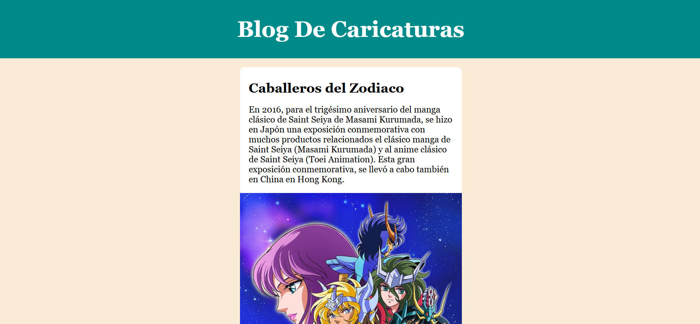

Blog de Caricaturas (Anime Clásico)

Uno de mis primeros proyectos cuando comencé a aprender programación hace 2 años.  
Es un blog **sencillo pero funcional** que muestra artículos sobre **anime clásico**, incluyendo:

- Caballeros del Zodiaco
- Dragon Ball Z
- Naruto

Este proyecto representa mis **primeros pasos en desarrollo web**, enfocado en practicar HTML semántico, estructura de documentos, y estilos CSS básicos.

---

Vista previa

 

---

##  Funcionalidades

- Blog estático con artículos.
- Diseño básico centrado.
- Efectos `hover` en tarjetas.
- Navegación rápida al inicio.
- Estilos organizados y separados en `index.css`.
- Script de prueba (con `Archivo.js`) preparado para futura funcionalidad dinámica.

---

##  Tecnologías usadas

| Tecnología | Uso principal        |
|------------|----------------------|
| HTML5      | Estructura del blog  |
| CSS3       | Estilos y diseño     |
| JavaScript | Archivo enlazado para futuras funciones dinámicas |

---


##  Licencia
Este proyecto fue creado solo con fines educativos y personales.

##  Cómo usar

1. Clona el repositorio:
```bash
git clone https://github.com/jquinteromo/Blog-ejemplo-caricaturesco.git
```

2. Abre index.html en tu navegador favorito.


[Ver proyecto en vivo](https://blog-ejemplo-caricaturesco.vercel.app/)


